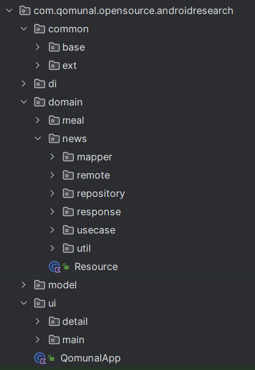
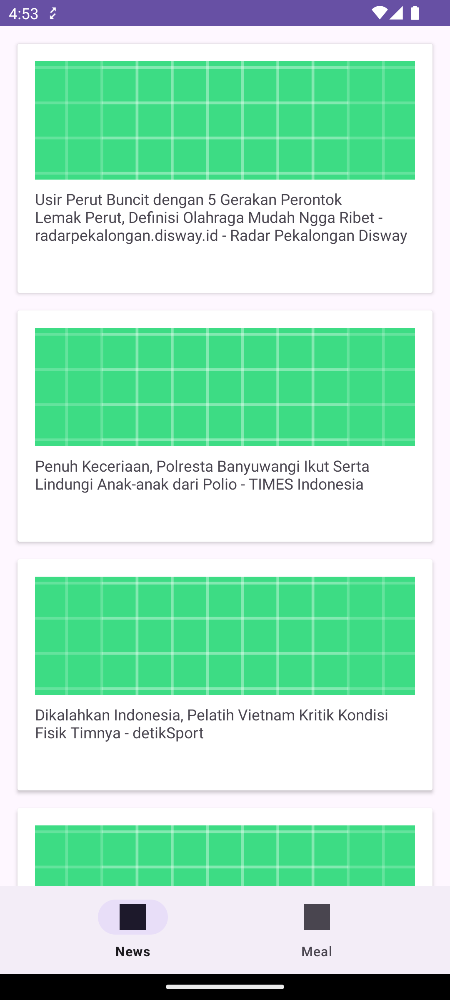

## Android MVVM
- Template repository for doing research on Android Technologies

## API Reference
- [NEWS API](https://newsapi.org/)
- [MEAL API](https://www.themealdb.com/api.php)

## Tech Stack
- Coroutine 
- Hilt

## Structure

## Screen Shot
|                           NEWS API                           |                           MEAL API                           |
|:------------------------------------------------------------:|:------------------------------------------------------------:|
|  |  |

## Colaborator
Very open to anyone, I'll write your name under this, please contribute by sending an email to me

- Mail To faisalamircs@gmail.com
- Subject : Github _ [Github-Username-Account]  _ [Repository-Name]
- Example : Github_amirisback_android-research

Name Of Contribute
- Amir Qomunal
- Waiting List
- Waiting List

Waiting for your contribute

## Attention !!!
- Please enjoy and don't forget fork and give a star
- Don't Forget Follow teamqomunal Github Account

